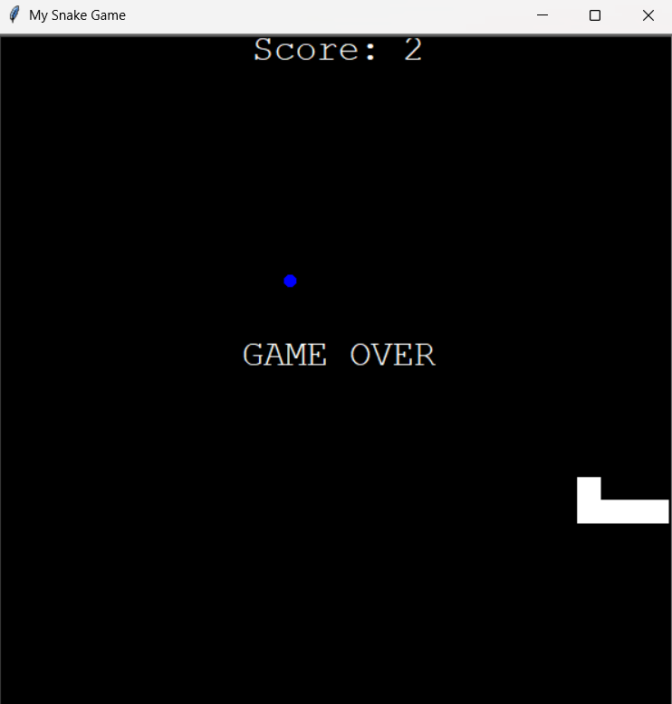

# 🐍 Snake Game (Python Turtle)

Classic Snake, written from scratch in Python with the built-in `turtle` graphics.  
Move with the arrow keys, eat the food, and whatever you do… don’t crash into yourself.  

Simple? Yes. Addictive? Absolutely.  

---

## ✨ Features
- 600×600 playfield with walls (old school style)
- Snake grows every time it eats food
- Randomized food spawning
- Scoreboard that actually works (no cheating here)
- Game over screen when you inevitably overestimate your reflexes

---

## 📸 Preview


---

## 🛠 Requirements
- **Python 3.10+**
- Standard library only:
  - `turtle`
  - `random`
  - `time`

👉 If you don’t have Python yet, grab it here: [python.org/downloads](https://www.python.org/downloads/)

---

## 🚀 Run It
Clone and play:

```bash
git clone https://github.com/<your-username>/snake-game.git
cd snake-game
python3 main.py
